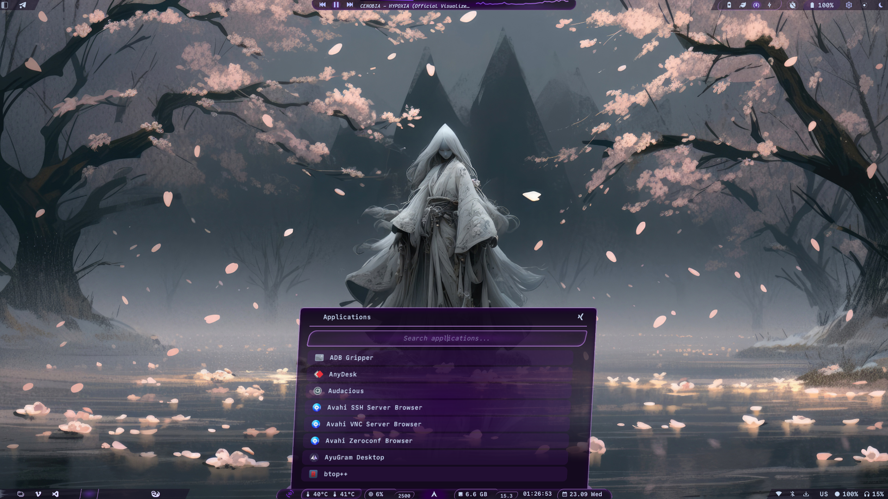
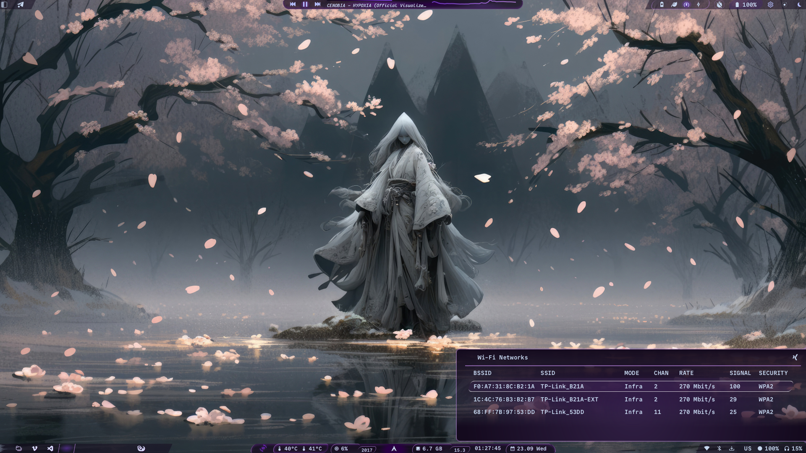
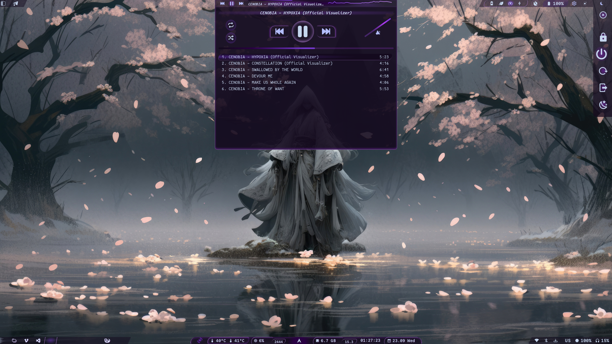
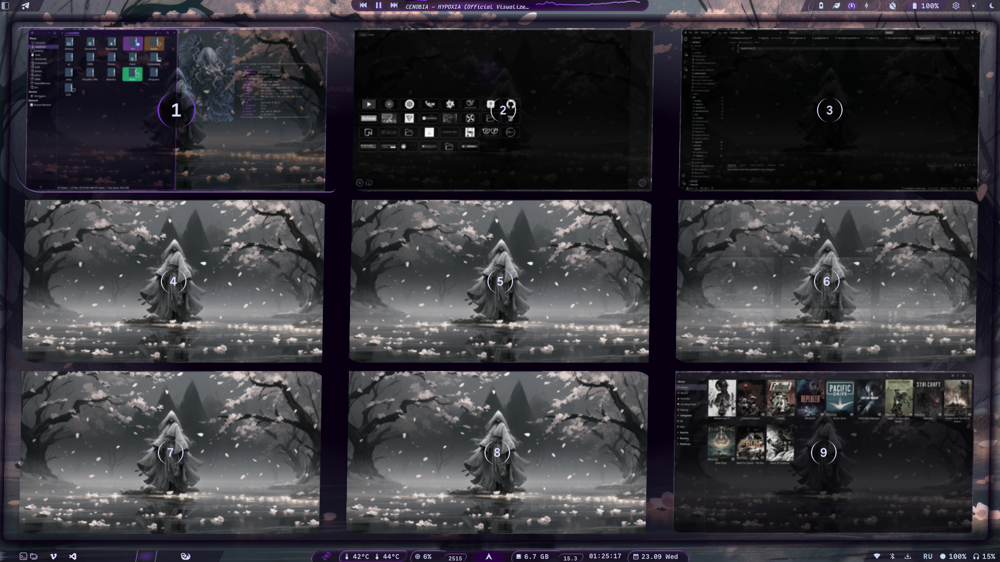

# Betwixt

~ *Custom AGS/Astal shell created for Hyprland.*

**_Work-In-Progress_**


## DEMO








## FEATURES
- Top+Bottom bars layout
- Launch-pad grid ("Desktop") for commands: _assign icon and command to any position, and launch it by click._
- Weather forecast (5 days, Open-Meteo)
- Readtime system stats: CPU load/temp/freq, RAM, GPU temp
- App launcher
- Player with playlist (_audacious only_) 
- Screen capture actions
- Workspace with per-app icons / Workspaces overview (user-space, screen caching)
- Power profiles with CPU freq limitations
- Battery tressholds with actions


## REQUIREMENTS
1. Check requirements list; required packages provided in **_requirements.list_** file in root dir. Install manually. Use any helper you want.
2. To use Power profiles, make **__cpupower__** passwordless. Otherwise, CPU freq can`t be limited by shell buttons.
    ```bash
    U=$(whoami)
    echo -e "$U ALL=(ALL) ALL\n$U ALL=(ALL) NOPASSWD: /usr/bin/cpupower" | sudo tee /etc/sudoers.d/69-$U > /dev/null
    sudo chmod 0440 /etc/sudoers.d/69-$U
    ```
    
3. I use **NVidia** GPU, so <ins>__on `AMD` there will be gray 3D icon and no GPU temp__</ins>, cause I use **nvidia-smi** for it. Look to **./lib/core/system-stats.ts** to adjust. I do not have AMD hardware to do it.
4. Look inside **_./configs_** directory, and customize config files. **Important:** you need to perform instructions from **__*_example.json__** to create several configs (desktop / weather).


## Installation and running
1. Install requirements
2. Download/clone this project and place it somewhere on your disk
3. Look and configure configs inside **./configs/** dir
4. Run it in terminal: `ags run /path/to/app.ts & disown`
5. For autostart, add in your **hyprland.lua**: 
```lua
hl.on("hyprland.start", function ()
    hl.exec_cmd("ags run /path/to/app.ts")
    -- ...(your other autostart commands...)
end)
```


## Hyprland integration
~ Betwixt uses AGS signals to perform shell actions. Full list of supported actions proveded in **./lib/services/actions.ts**

Syntax for **hyprland.lua** is: `hl.bind({COMBINATION}, hl.dsp.exec_cmd("ags request '{ACTION-NAME}'"))`

Example:
```lua
hl.bind(mainMod .. " + R", hl.dsp.exec_cmd("ags request 'toggle-apps'"))
```

### **May be useful**: 

Look to **__./third-party/__** dir :)

There are examples of my hyprland config, themes and configs for some external tools.


## TASKS
### Hot reload configs
- [x] Desktop
- [x] Weather
- [x] Players
- [x] Workspaces
- [ ] Battery
- [ ] Languages-map
- [ ] Powerplans
- [ ] Screen-capture
### Settings
- [x] Window
- [ ] Categories
- [ ] Theme changing
- [ ] Color palete generation
- [ ] Widgets relocation between bars
- [ ] Bars hiding
### Features
- [ ] Own wallpaper surface (hyprpaper replacement)
- [ ] Own lockscreen (hyprlock replacement)
- [ ] Translator (Google)
- [ ] AI chat panel (API access)