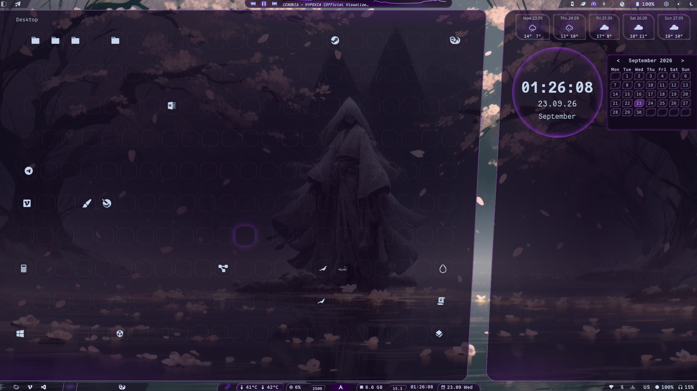
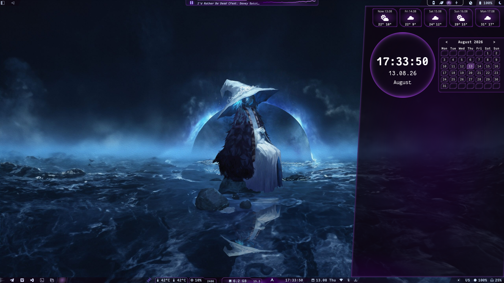
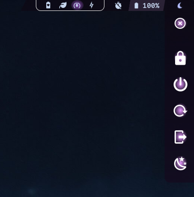
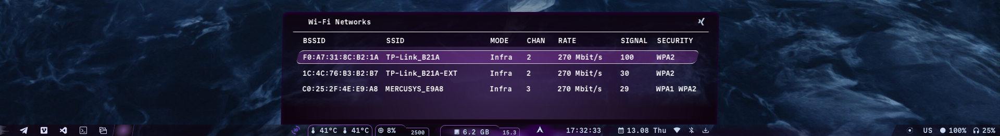

# Betwixt shell (AGS / Astal)

~ *Shell created for Hyprland.*

*!! WorkInProgress !!*


## DEMO








## KEY FEATURES
#### Bars & widgets
- Top & bottom bars
- Workspaces tabs with per-app icons driven by regex rules (`./configs/workspaces.json`)
- Live system stats: CPU temp / usage / frequency, discrete GPU temp, RAM
- MPRIS player: seekable progress bar, bezier-curve cava
- System tray with styled popovers
- Updates counter: official repos + AUR helper autodetect
#### Panels
- App launcher with live search
- Wi-Fi & bluetooth panels
- Desktop grid with hot reload on config change (`./configs/desktop.json`)
- Right side panel: 5-day weather forecast (Open-Meteo), clock, month-navigable calendar
#### Power & automation
- Battery indicator with warning / critical thresholds and per-level custom actions (`configs/battery.json`)
- AC plug / unplug automation: power plan switch + idle daemon control
- Four CPU power modes via powerprofilesctl + cpupower
- hypridle daemon toggle indicator
- Power menu: lock, suspend (with pre-lock), reboot, poweroff, logout
#### Screen tools
- Screen video recording with start / stop sounds (wf-recorder)
- Screenshots: fullscreen / area to clipboard / to file / markup in satty
- Screen-area OCR translation (tesseract + translate-shell) — result to clipboard and notification
#### Quick hub
- Brightness & volume indicators with scroll control
- Mic volume / mute indicator
- Keyboard layout indicator with click-to-switch
#### Customization
- SCSS variable themes + styles hot reload
- Everything tunable via JSON configs (look to `./configs/` dir)
- Hyprland keybinds integration via `ags request` (look to `./lib/services/actions.ts` file)


## REQUIREMENTS
~ Check requirements list, you may delete / comment smth you don't need before install.

List of required packages provided in _requirements.list_

Quick installation script provided in _install-deps.sh_. Using (**terminal inside shell directory (!)**):
1. `chmod +x ./install-deps.sh`
2. `./install-deps.sh`


## Installation and running
1. Install requirements (`./install-deps.sh`)
2. Download/clone this project and place it somewhere on your disk
3. Look and configure configs inside `./configs/` dir
4. Run it in terminal: `ags run /path/to/app.ts & disown`
5. For autostart, add in your `hyprland.lua`: 
```lua
hl.on("hyprland.start", function ()
    hl.exec_cmd("ags run /path/to/app.ts")
    -- ...(your other autostart commands...)
end)
```


## Required configuration
- Look to `./configs/{name}_example.json` files and create your own `./configs/{name}.json` without *_example* in name. Instruction provided in every such file.


## Hyprland integration
Betwixt uses AGS signals to perform shell actions. Full list of supported actions proveded in */lib/services/actions.ts*

Syntax for _hyprland.lua_ is: `hl.bind({COMBINATION}, hl.dsp.exec_cmd("ags request '{ACTION-NAME}'"))`

Example:
```lua
hl.bind(mainMod .. " + R", hl.dsp.exec_cmd("ags request 'toggle-apps'"))
```